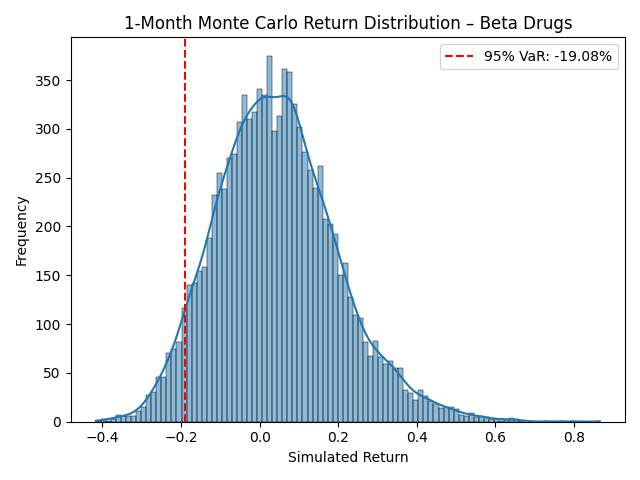

# Beta Drugs Ltd. – 1-Month Value at Risk (VaR) Estimation

## Objective
Estimate the **1-month (21 trading days)** 95% **Value at Risk (VaR)** for **Beta Drugs Ltd.** using **Monte Carlo simulation** based on historical price data.

## Files in This Repo

| File               | Description                                  |
|--------------------|----------------------------------------------|
| `BETA.csv`         | Historical adjusted close price data         |
| `beta_var.py`      | Main script for VaR estimation & plotting    |
| `beta_var_plot.png`| Simulated return distribution visualization |
| `requirements.txt` | Python dependencies                         |

## Methodology
- Download or clean historical daily price data of Beta Drugs
- Compute **daily returns** from the adjusted close price
- Assume returns follow a **normal distribution**  
- Simulate **10,000 future 21-day return paths**
- Estimate **95% VaR** from the 5th percentile of simulated returns

## Sample Result
On running the simulation for data till 30 June 2025:
1‑Month 95% VaR ≈ −19.08%
This means there's a 5% chance of losing more than **19.08%** in a month.

## Plot Example


## How to Run This Project

1. Clone the repo:
   ```bash
   git clone https://github.com/rahulkr-2107/beta-drugs-var.git
   cd beta-drugs-var
2. Install dependencies:
   ```bash
   pip install -r requirements.txt
3. Run the main script
   ```bash
   python beta_var.py

## Dependencies
  pandas
  numpy
  matplotlib
  seaborn

🙋 About Me
I'm a CFA Level II candidate passionate about risk analysis and equity research. This project was done as a hands-on demonstration of Python-driven financial risk modeling.
Connect with me: [LinkedIn](www.linkedin.com/in/rahul-kumar-b29425138)
